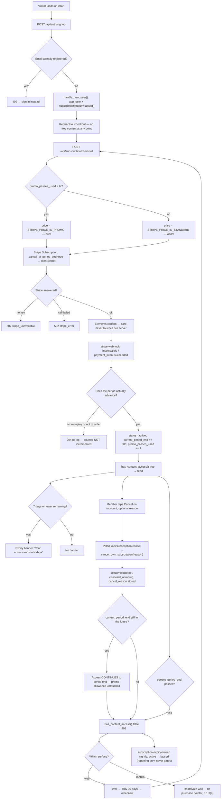

# Paid-only subscription — no free trial, $9 for six passes then $19, member cancel

**Linear:** ENG-997 · **Grilled:** 5 Sep 2026 · **Integration branch:** `feature/pricing-v1`

## Ask

The free trial goes away entirely. Everyone pays from the first day. The first six 30-day
passes cost **A$9**; from the seventh, **A$19**. Members get a real Cancel control, and the
expiry path is tested properly.

This is the session ENG-946 and ENG-982 explicitly reserved. ENG-946: *"Deliberately NOT
ticketed: the pricing change… held for a `/rx:grill-me` session rather than guessed at,
because the transcript never states the promo duration, what happens to members mid-trial at
cutover, or which Stripe price object is real — three money-touching unknowns."* All three are
answered below. ENG-565 is superseded by ENG-998.

## What was already true

- `handle_new_user()` (`20260815120000_member_identity_and_access.sql`) creates
  `subscription(status='trial', trial_ends_at = now() + 30 days)` — no card, no Stripe objects.
- The paid plan is a **non-renewing 30-day pass**: web checkout creates a Stripe Subscription
  with `cancel_at_period_end: true` **at creation** (ENG-567). Nothing auto-renews, and
  `/api/subscription/cancel` was deleted outright by that ticket.
- One price only, `STRIPE_PRICE_ID` (sandbox A$1.00). No second price object exists.
- `has_content_access()` is expiry-aware (ENG-566). **`canceled` grants nothing.**
- `trial-sweep` (every 15 min, ENG-948) and `subscription-expiry-sweep` (nightly). Neither gates
  access — both only keep the status column truthful for reporting.
- Mobile is a **reader app**: every external purchase pointer was removed 2 Sep for 3.1.3(a).
- The marketing site is **live and selling**. `data-cta-mode="trial"` is hardcoded at
  `app/(marketing)/layout.tsx:135`, there is no waitlist code on `main` (ENG-721 still Backlog),
  and every CTA points at `/start`, which today issues a free trial.

## Locked decisions

| Question | Answer |
| -- | -- |
| Standing price | **A$19/month.** The site was already right; the "$16" in the ask was a slip |
| Renewal model | **Unchanged** — non-renewing 30-day passes. This epic does NOT add auto-renewal |
| Promo shape | **First 6 passes cost A$9.** Lifetime allowance, not a time window |
| Promo eligibility | Everyone, forever. The 30 Nov 2026 deadline is dropped (copy only — parked) |
| Early top-up | Counts toward the six and is priced by the counter. A member may buy all six up front: **A$54 for 180 days** |
| Free trial | **Fully retired** — dropped from the CHECK, from the gate, `trial-sweep` deleted, rows wiped |
| Trials at cutover | Cut. **No real members** — test/internal accounts only |
| New signup lands in | `subscription(status='lapsed')`, redirected straight to `/checkout` |
| Cancel | **Web `/account` only.** Ends at period end, keeps paid days, optional free-text reason |
| Cancel and the promo | Cancelling never burns the allowance |
| Mobile | No cancel UI, no purchase pointer. Gate + wall copy only |
| Stripe prices | Do not exist. ENG-998 creates both |
| Admin | Out of scope; follow-up after ENG-982 merges |
| Marketing + legal copy | **Parked** — ENG-1005 |

## Three consequences that were not in the ask

**1. `canceled` must now grant access** while `current_period_end > now()`. Today it grants
nothing on the status alone. **This changes `.rx/guardrails.md` #3** (be), which reads
"status ∈ {trial, active}" — a guardrail text edit, not just code.

**2. The BFF cannot write the cancellation.** `public.subscription` exposes only SELECT to
`authenticated`; a direct update matches **zero rows and returns no error**. ENG-582 spent a
whole ticket discovering that in the checkout route. Cancel goes through a `SECURITY DEFINER`
RPC self-scoped to `auth.uid()`. **No Stripe call is needed** — the Subscription already carries
`cancel_at_period_end: true`.

**3. The checkout reuse filter is a live mis-charge risk.** It matches pending Subscriptions on
`price.id === STRIPE_PRICE_ID`. With two prices, a member who exhausted the allowance could have
a stale **A$9** pending Subscription reused. It must match the *chosen* price.

## Feature flow



## API & data flow

```mermaid
sequenceDiagram
  actor M as Member
  participant W as stablepass-web BFF
  participant S as Stripe
  participant F as stripe-webhook (be)
  participant D as Postgres

  M->>W: POST /api/auth/signup {firstName,lastName,email,phone,postcode,password}
  W->>D: auth.signUp → handle_new_user()
  D-->>W: subscription{status:'lapsed', trial_ends_at:null}
  W-->>M: 201 → redirect /checkout

  M->>W: POST /api/subscription/checkout
  W->>D: select promo_passes_used, status, stripe_customer_id, current_period_end
  D-->>W: {promo_passes_used:0, status:'lapsed'}
  W->>S: prices.retrieve(PROMO); subscriptions.create(cancel_at_period_end:true, metadata.app_user_id)
  S-->>W: clientSecret, unit_amount:900, currency:'aud'
  W-->>M: 200 {clientSecret, unitAmount:900, currency:'aud', mode:'purchase', promoRemaining:6}
  M->>S: Elements confirmPayment — card never reaches our server

  S->>F: invoice.paid (Stripe signature is the only auth)
  F->>D: status='active', current_period_end=now+30d, promo_passes_used=1
  F-->>S: 204

  alt redelivered or out-of-order event
    S->>F: invoice.paid again
    F-->>S: 204 — period does not advance, counter unchanged
  end

  M->>W: POST /api/subscription/cancel {reason?}
  W->>D: rpc cancel_own_subscription(p_reason)
  D-->>W: {status:'canceled', canceled_at, current_period_end}
  W-->>M: 200 — access continues to current_period_end

  M->>W: GET gated content after current_period_end
  W->>D: has_content_access(auth.uid())
  D-->>W: false
  W-->>M: 402 subscription_required
```

## Deploy order (owned by the [Gate], ENG-1006)

```
1. Create both Stripe prices + set the two env vars     — ENG-998
2. supabase db push                                     — ENG-999
3. supabase functions deploy stripe-webhook             — ENG-1000 (MUST precede the web deploy)
4. deploy web                                           — ENG-1001 / ENG-1002 / ENG-1003
5. build + ship mobile                                  — ENG-1004
```

Reversing 3↔4 means a member pays and the counter never increments — they keep A$9 forever.
Reversing 2↔4 gives a hard PostgREST **42703** on `promo_passes_used` (the ENG-560 / ENG-566
failure mode). P0 before 4 or checkout 502s on a missing price id.

## Cross-epic collisions

- `src/providers/gate.tsx` — ENG-947 and ENG-992 are both In Review on it. ENG-1004 is blocked by both.
- `app/(marketing)/sections/hero.tsx` + FAQ — ENG-977 owns them. The marketing slice is parked
  entirely (ENG-1005), so there is no overlap.
- `app/api/admin/analytics/*` — ENG-984 owns it. Retiring `trial` leaves admin's trials tab
  returning an **empty cohort, not an error**, so no dependency is needed.

## Guardrails

No owner PII · RLS is the access boundary · content gated on subscription — **now `active` or
`canceled`, both expiry-checked** · `subscription` writes service-role or `SECURITY DEFINER`
only, never the BFF · the Stripe signature is the webhook's only authentication · card data
never reaches our server · secrets from env · `SECURITY DEFINER` functions keep
`set search_path = public, pg_temp` (ENG-451) · **the member can never influence which price
they are charged**.

## Out of scope

Auto-renewal · refunds · IAP / StoreKit · billing portal · Stripe Tax · flipping the site to
selling · admin UI (follow-up) · showing the member how many A$9 passes remain · email/push on
cancellation (ENG-983 cancelled — churn is seen in admin).

## Slices in this repo

| Ticket | Scope |
| -- | -- |
| ENG-998 | ops — Stripe A$9 + A$19 prices, `STRIPE_PRICE_ID_PROMO`/`_STANDARD`. Only repo diff is `.env.example` |
| ENG-1001 | Checkout picks the price server-side; reuse filter fixed. See `2026-09-05-paid-only-subscription-p3-checkout-design.md` |
| ENG-1002 | Member cancel. See `2026-09-05-paid-only-subscription-p4-cancel-design.md` |
| ENG-1003 | Trial out of the funnel. See `2026-09-05-paid-only-subscription-p5-funnel-design.md` |

Other repos: be ENG-999/1000, mobile ENG-1004, gate ENG-1006. Parked copy work: ENG-1005.
