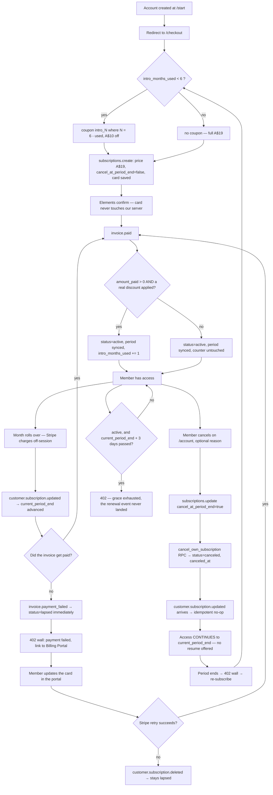
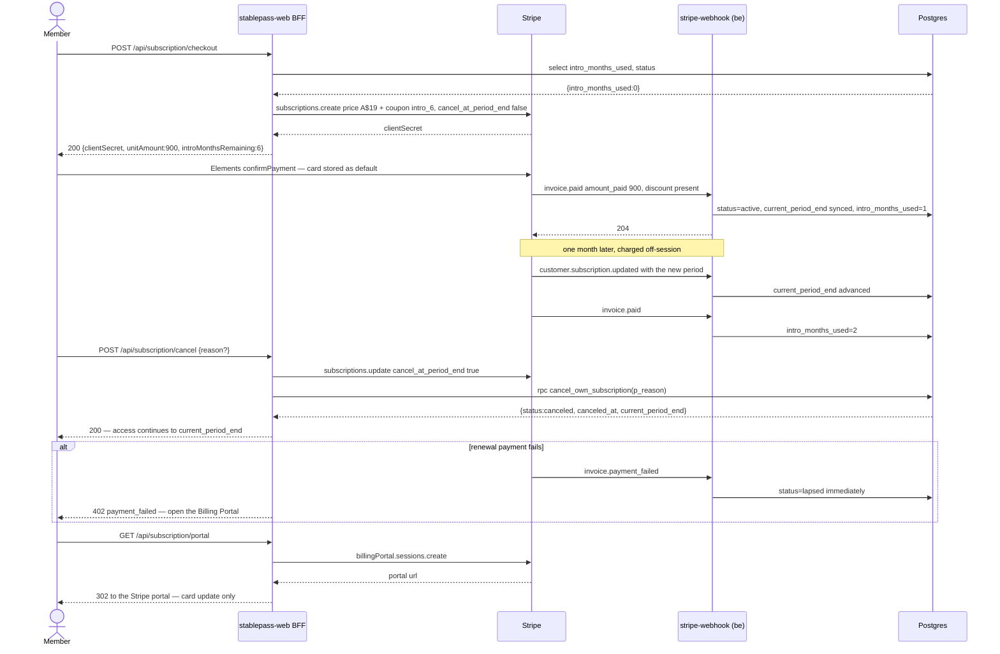

# Auto-renewing subscription — monthly renewal, Stripe-owned intro coupon, Billing Portal

**Linear:** ENG-1022 · **Grilled:** 6 Sep 2026 · **Integration branch:** `feature/pricing-v1`

## Ask

The subscription now **auto-renews**. There is no extend/top-up, and cancel stops the renewal
while access runs to the period end.

**This supersedes ENG-997's core model.** That epic built a non-renewing 30-day pass and all eight
of its slices are `Done` and merged onto this same branch. Nothing has reached `main`, so this is a
rework of merged-but-unreleased code: no billing migration, no proration, no real member to explain
a model change to. All three of those become real the moment this branch merges.

## What survives from ENG-997, and what reverses

**Survives** — trial retirement, the `lapsed`-on-signup funnel, `cancel_own_subscription()`,
`canceled` granting access to the period end, the mobile gate's status set, and ENG-1009's
reactivation discriminator.

| Built by ENG-997 | Becomes |
| -- | -- |
| `cancel_at_period_end: true` at creation | `false` — it renews |
| Checkout Branch B, early-renewal top-up | Deleted. ENG-1007's idempotency key goes with it |
| `customer.subscription.updated` → 204 no-op | The cancel flag is now the **cancellation signal**, and the event carries the new period |
| `promo_passes_used` picking between two prices | Stripe bills via a repeating coupon; we keep `intro_months_used` for eligibility |
| `subscription-expiry-sweep` | **Retired** — it would mark paying members lapsed during renewal lag |
| No payment-method management | **Stripe Billing Portal**, card + invoices only |

## The three landmines this epic defuses

**1. A paying member locked out at every renewal.** `has_content_access()` denies an `active` row
the instant `current_period_end` passes. Correct for a pass that genuinely ended there; wrong when
there is a gap between the period rolling over and `invoice.paid` landing. Fixed twice over: R2
syncs the period from `customer.subscription.updated`, and R1 adds a **3-day grace** on `active`.
`canceled` stays strict — that date is a real ending.

**2. The sweep would mark payers lapsed.** Its own header says why it was safe: *"there is no
auto-renewal lag to grace, unlike a subscription model where the next invoice might still be in
flight."* No longer true, so it is retired.

**3. There are THREE copies of the access gate.** `has_content_access()` in SQL,
`supabase/functions/_shared/access.ts` (used by `feed`, `playback`, `post-media`), and
`lib/api/access.ts` in web. `test/shared/access.test.mjs` compares the first two directly, so
**R1 owns SQL and the edge copy in one PR**; R5 brings web into line.

## Locked decisions

| Question | Answer |
| -- | -- |
| Model | Auto-renewing monthly. `cancel_at_period_end: false` at creation |
| Extend / top-up | Deleted — there is nothing to extend |
| Promo | Six static Stripe coupons `intro_1`…`intro_6`, `amount_off: 1000 aud`, `duration: repeating` |
| Which price | Always A$19. The A$9 comes from the coupon |
| Returning member | **$9 for their remaining months.** Cancel after 2, return, get `intro_4` |
| The counter | `promo_passes_used` → **`intro_months_used`**; increments only on an invoice genuinely paid AND genuinely discounted (ENG-1011's lesson) |
| Cancel | BFF calls Stripe `cancel_at_period_end: true` **then** the RPC. Access to period end |
| Resume | Not offered |
| Card management | Billing Portal, cancel + resume **disabled** in its configuration. Web only |
| Failed renewal | Access cut **immediately** on `invoice.payment_failed` — chosen knowing Stripe retries ~2 weeks |
| Renewal lag | Period synced from `subscription.updated` + **3-day grace** on `active` only |
| Expiry sweep | Retired |
| Mobile | Gate unchanged; banner only |

## Feature flow



## API & data flow



## Deploy order (owned by the [Gate], ENG-1031)

```
1. Coupons + portal configuration + env vars                        — ENG-1023
2. supabase db push                                                 — ENG-1025
3. supabase functions deploy stripe-webhook feed playback post-media — ENG-1025 / ENG-1026
4. deploy web                                                       — ENG-1027 / ENG-1028 / ENG-1029
5. build + ship mobile                                              — ENG-1030
```

Step 3 deploys **four** functions: `_shared/access.ts` is bundled into `feed`, `playback` and
`post-media`, so shipping the SQL grace without the TS grace leaves RLS granting while those
functions answer 402. 3 before 4 or nothing advances a member's period; 2 before 4 or checkout
takes a PostgREST **42703**; 1 before 4 or the coupon lookup 502s.

## Guardrails

No owner PII · RLS is the access boundary · content gated on subscription — `active` (with grace)
or `canceled` (strict) · `subscription` writes service-role or `SECURITY DEFINER` only, never the
BFF · the Stripe signature is the webhook's only authentication · card data never reaches our
server (Elements + hosted portal) · secrets from env · definer functions keep
`set search_path = public, pg_temp` (ENG-451) · **the member can never influence which coupon they
receive** · mobile carries no external purchase pointer (3.1.3(a)).

## Out of scope

Plan switching · annual plans · proration · refunds · IAP · resume after cancel · admin MRR UI ·
flipping the marketing site to selling · the parked copy work (ENG-1005, now much smaller because
`cancellation.md` §8's auto-billing language became **correct**).

## Slices in this repo

| Ticket | Scope |
| -- | -- |
| ENG-1023 | ops — six `intro_N` coupons + Billing Portal configuration. Only repo diff is `.env.example` |
| ENG-1027 | Checkout becomes subscribe. See `2026-09-06-auto-renew-subscription-r3-subscribe-design.md` |
| ENG-1028 | `/account` + portal route + cancel calls Stripe. See `2026-09-06-auto-renew-subscription-r4-account-portal-design.md` |
| ENG-1029 | Gate parity + banner. See `2026-09-06-auto-renew-subscription-r5-gate-parity-design.md` |

Other repos: be ENG-1025/1026, mobile ENG-1030, gate ENG-1031.
Supersedes ENG-997's model; ENG-1006 (its gate) is cancelled.
