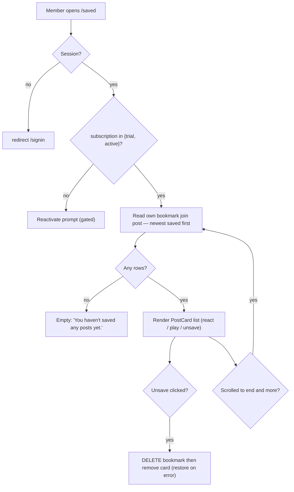

# W12 · web · Saved — bookmarked posts list (Explore-style)

**Repo:** stablepass-web · **Base branch:** `feature/member-web-v1` · **Epic:** ENG-187 (Member Web v1)
**Date:** 2026-07-15 · Grilled with the user. Held in Backlog until the epic review is accepted.

## Why / who
Members bookmark posts across Explore/profiles (the `bookmark` write already ships). The sidebar
already links **Saved**, but the route doesn't exist (dead link → 404). This screen makes Saved
resolve: the member's saved posts, styled like Explore.

## Current state (grounded)
- `bookmark` table (`PK (user_id, post_id)`, `created_at`) + RLS `bookmark_rw_self` — exist.
- Bookmark/unbookmark actions — exist in Explore + profile feeds.
- `PostCard` / `ReactionBar` (W4) + `/api/posts/:id/playback` (W5) — shipped.
- Design docs already spec it: `screen-api-map` §11 Bookmarks ("Saved list, newest-first, [PG] GET
  bookmark join post"); `api-contract` ("GET bookmarks, newest-first").
- **No dedicated mockup** — pattern-based, like W8 trainers.

## Decisions (locked with the user)
- Sort: **newest saved first** (`bookmark.created_at` desc).
- Unsave on this screen: **optimistically remove the card** (restore on error).
- Layout: **single post column** — title "Saved", no tabs, no right aside.
- Data: **client-fetch** (direct PostgREST `bookmark`→`post` via `supabaseBrowser`) + client
  subscription gate — **no new BFF route**, mirrors HorsesGrid/TrainersGrid + the `[PG]` design.
- **No impression recording**. Infinite scroll (keyset on `bookmark.created_at`, LIMIT 10). Card
  shows posted-time (reuse `PostCard` as-is; W4 untouched).

## Surface (owns)
- `app/(member)/saved/page.tsx` — server; resolves `viewerId` (mirror `explore/page.tsx`).
- `app/(member)/saved/saved-feed.tsx` — client; fetch + enrich + render.
- `test/saved-feed.test.tsx` — the pass/fail test.
- Do-NOT-touch: `components/**` (W4), `app/(member)/explore/**` (W6), any `app/api/**`, sidebar/shell (W1).

## Behaviour / contract
1. `page.tsx` resolves the member session (`viewerId`) like other `(member)` pages; the shell/layout
   handles the no-session redirect.
2. Client gate: `supabaseBrowser().from("subscription").select("status").eq("user_id", viewerId)` →
   if not in `{trial,active}` render the reactivate prompt (no content). Never render gated content
   before the gate resolves.
3. List: `sb.from("bookmark").select("created_at, post:post_id(*)").order("created_at",{ascending:false}).limit(10)`
   (next page via `.lt("created_at", cursor)`). Drop rows whose `post` is null (RLS-hidden/unpublished).
4. Enrich each post: horse `display_name` + trainer name (`horse` embed) + the viewer's own
   `reaction` — same maps as `explore-feed.tsx`. `bookmarked: true` for all.
5. Render `PostCard` per post: react (`reaction` upsert/delete), play (`/api/posts/:id/playback`),
   **unsave** (`bookmark` delete) → remove the card from local state (restore on error).
6. States: skeleton (loading) · empty ("You haven't saved any posts yet." + pointer to Explore) ·
   error ("Couldn't load your saved posts.") · gated (reactivate prompt).

## Feature flow

## Guardrails (from .rx/guardrails.md)
- RLS is the boundary: `supabaseBrowser` reads only own bookmarks + gated posts; no service role, no
  token in the DOM.
- No owner PII rendered.
- Subscription-gated: lapsed → reactivate; no optimistic gated render.
- Video only via `/api/posts/:id/playback` (Mux signed URL); never a raw asset.
- Positive-only reactions; no comments.

## Acceptance / tests (pass-fail)
`test/saved-feed.test.tsx` asserts:
- renders bookmarked posts **newest-saved-first**;
- clicking **unsave removes** the card from the list;
- **empty** state when there are no bookmarks;
- **lapsed** subscription renders the **reactivate** prompt, not content.
Plus `npm run typecheck && lint && build && test` green.

## Out of scope
Sidebar/shell, Explore, W4 components, any BFF route, `/following` & `/notifications` (other dead
links), any BE change or migration.
