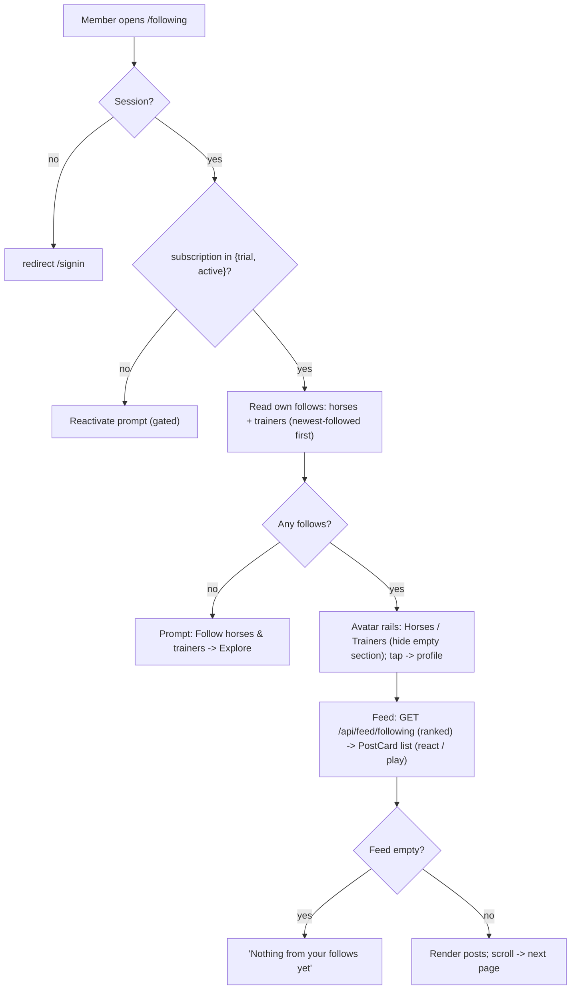

# W13 · web · Following — followed horses/trainers rails + feed

**Repo:** stablepass-web · **Base branch:** `feature/member-web-v1` · **Epic:** ENG-187 (Member Web v1)
**Date:** 2026-07-15 · Grilled with the user. Held in Backlog until the epic review is accepted.

## Why / who
The sidebar "Following" link is a dead 404. Members want a hub for who they follow: a "stories"-style
rail of their followed horses & trainers (tap → profile) plus a feed of those follows' posts. Chosen
to **replace Explore's "Following" tab** — `/following` becomes the following experience, Explore
simplifies to a single feed.

## Current state (grounded)
- `follow` table (`user_id` + exactly one of `trainer_id`/`horse_id`, `created_at`, unique) + RLS
  `follow_rw_self` — exist. Follow/unfollow live on the horse/trainer profiles (`follow-notify.tsx`).
- `explore-feed.tsx` already reads followed trainers (the "Trainers you follow" aside).
- Ranked **Following feed** `/api/feed/following` (edge fn) — exists; currently powers Explore's
  "Following" tab.
- `PostCard`/`ReactionBar` (W4) + `/api/posts/:id/playback` (W5) — shipped. `horse`/`trainer` carry
  `photo_url`.
- **No dedicated mockup** — pattern-based (IG-style reference: two avatar rails + a feed).

## Decisions (locked with the user)
- Feed source: **reuse `/api/feed/following`** (ranked, unseen-first) **and DROP Explore's "Following"
  tab** (Explore becomes single-view).
- Interaction: **view + navigate only** — tap an avatar → profile; **no unfollow** on this screen
  (profiles own it).
- Avatar order: **newest-followed first** (`follow.created_at` desc). Avatar = `photo_url`, falling
  back to the initial-letter thumb.
- Empty: **hide an empty section**; if the member follows nothing at all → a prompt linking to
  Explore/Horses. Feed shows its own empty line.

## Surface (owns)
- `app/(member)/following/page.tsx` — server; resolves `viewerId` (mirror `explore/page.tsx`).
- `app/(member)/following/following-screen.tsx` — client; avatar rails + feed.
- `app/(member)/explore/explore-feed.tsx` — **MODIFY**: remove the Explore/Following toggle, the
  `view` state, and the following fetch path → single "Explore" feed.
- `test/following-screen.test.tsx` — new. `test/explore-feed.test.tsx` — update (drop Following-tab
  assertions).
- Do-NOT-touch: `components/**` (W4), any `app/api/**` (reuse `/api/feed/following` read-only),
  sidebar/shell (W1).

## Behaviour / contract
1. `page.tsx` resolves the member session (`viewerId`) like other `(member)` pages.
2. Client gate: `subscription.status ∈ {trial,active}` → else reactivate prompt (no content first).
3. Rails (RLS-scoped `supabaseBrowser`):
   - Horses: `follow` embed `horse:horse_id(id, display_name, racing_name, photo_url)`, `horse_id`
     not null, `order(created_at desc)`.
   - Trainers: `follow` embed `trainer:trainer_id(id, name, display_name, photo_url)`, `trainer_id`
     not null, `order(created_at desc)`.
   - Render each as a horizontal rail of circular avatars (photo or initial) + name; tap →
     `/horses/[id]` / `/trainers/[id]`. Hide a section with zero rows; if BOTH empty → follow prompt.
4. Feed: `GET /api/feed/following` (ranked) → enrich each post with horse `display_name` + trainer
   name + the viewer's own `reaction` (same maps as `explore-feed.tsx`) → `PostCard` (react + play).
   Infinite scroll via the route's cursor.
5. Explore change: `explore-feed.tsx` drops the tab toggle + `/api/feed/following` path; renders only
   the `/api/feed` Explore feed. Its test loses the Following-tab assertions.
6. States: skeleton · empty (no follows → prompt) · error · gated (reactivate).

## Feature flow

## Guardrails (.rx/guardrails.md)
- RLS is the boundary: `supabaseBrowser` reads only own follows + gated horse/trainer/post; no service
  role, no token in DOM.
- No owner PII rendered.
- Subscription-gated: lapsed → reactivate; no optimistic gated render.
- Video only via `/api/posts/:id/playback` (Mux signed URL).
- Positive-only reactions; no comments.

## Acceptance / tests (pass-fail)
`test/following-screen.test.tsx` asserts:
- rails render followed **horses** and **trainers**, newest-followed first, and an avatar links to the
  profile;
- an empty section is hidden; **no follows at all → the follow prompt**;
- the **feed** renders posts from `/api/feed/following`;
- **lapsed** subscription → reactivate prompt, not content.
`test/explore-feed.test.tsx` updated: Explore renders **no Following tab**.
Plus `npm run typecheck && lint && build && test` green.

## Out of scope
Unfollow UI, notify toggles on avatars, sidebar/shell, W4 components, any BFF route change, any BE
change or migration.
